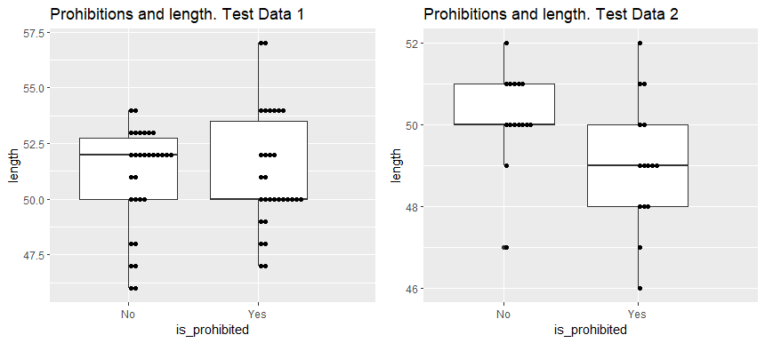
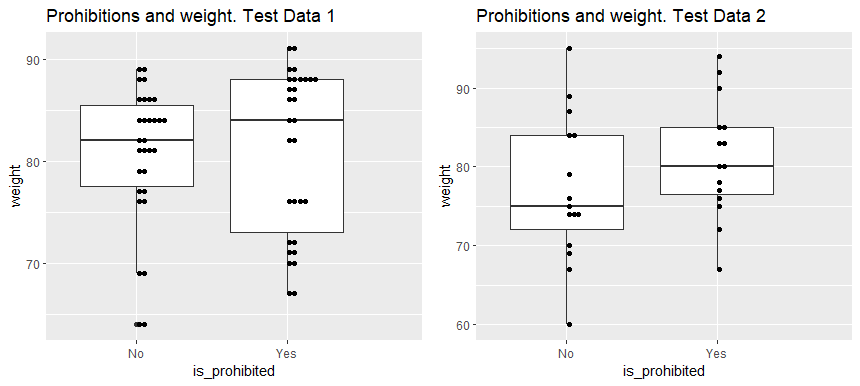
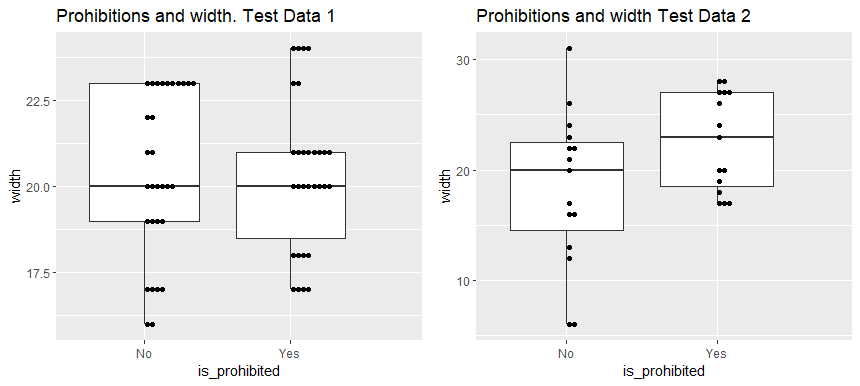
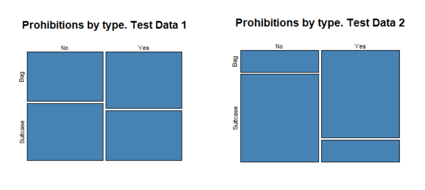

# Baggage analysis project

The purpose of this project is to demonstrate the ability to distinguish significant predictors in data and predict the value of the categorical variable. 

## Skills demonstrated 

- predictive analysis
- selection of significant and insignificant predictors using **anova**
- use of **logit regression** for categorical variable predictions 
- plotting with **ggplot2**
- commenting code so that it can be understood by others

## The data

I have several data sets of the following structure. 

| is_prohibited | weight | length | width | type     |
|---------------|--------|--------|-------|----------|
| No            | 69     | 53     | 17    | Suitcase |
| No            | 79     | 52     | 21    | Bag      |
| Yes           | 84     | 54     | 20    | Suitcase |

**test_data1** and **test_data2** are being used to test the **get_features** function, which returns a list of significant predictors in the data. Turned out, there aren't any in **test_data1**, but there are some in **test_data2**. 

## Plotting 
I was curious to look at the graphical presentation to compare **test_data1** and **test_data2**, and inside of each data set compare parameters of prohibited and not prohibited baggage. 

## Predicting 

In the second part of the project, I use a data set of a similar structure to predict whether baggage that is being scanned now is going to be prohibited.

The table about the new baggage looks like this:

| weight | length | width | type     | passanger |
|--------|--------|-------|----------|-----------|
| 95     | 54     | 19    | Suitcase | Vsevolod  |
| 80     | 59     | 19    | Suitcase | Vilimir   |
| 70     | 53     | 22    | Bag      | Svetozar  |

The **most_suspicious** function creates a model on test data and uses this model to predict on new data. A new column of predicted valuables is being added to the new dataset. If a value is higher than 0.7 (the borderline was chosen manually), the owner of this baggage is called to an additional check.
